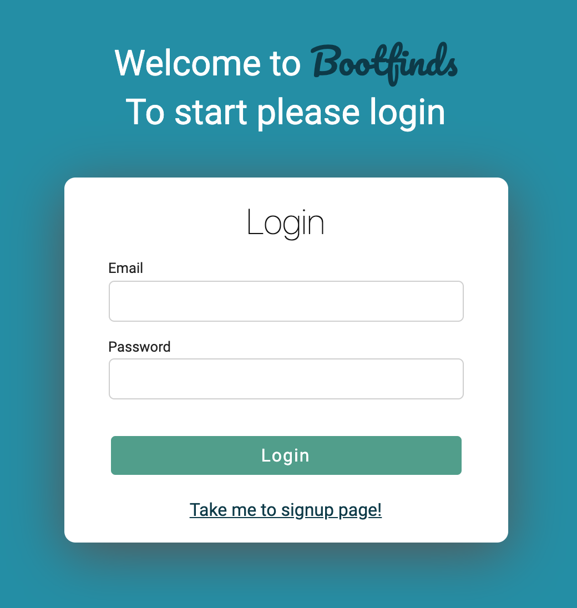
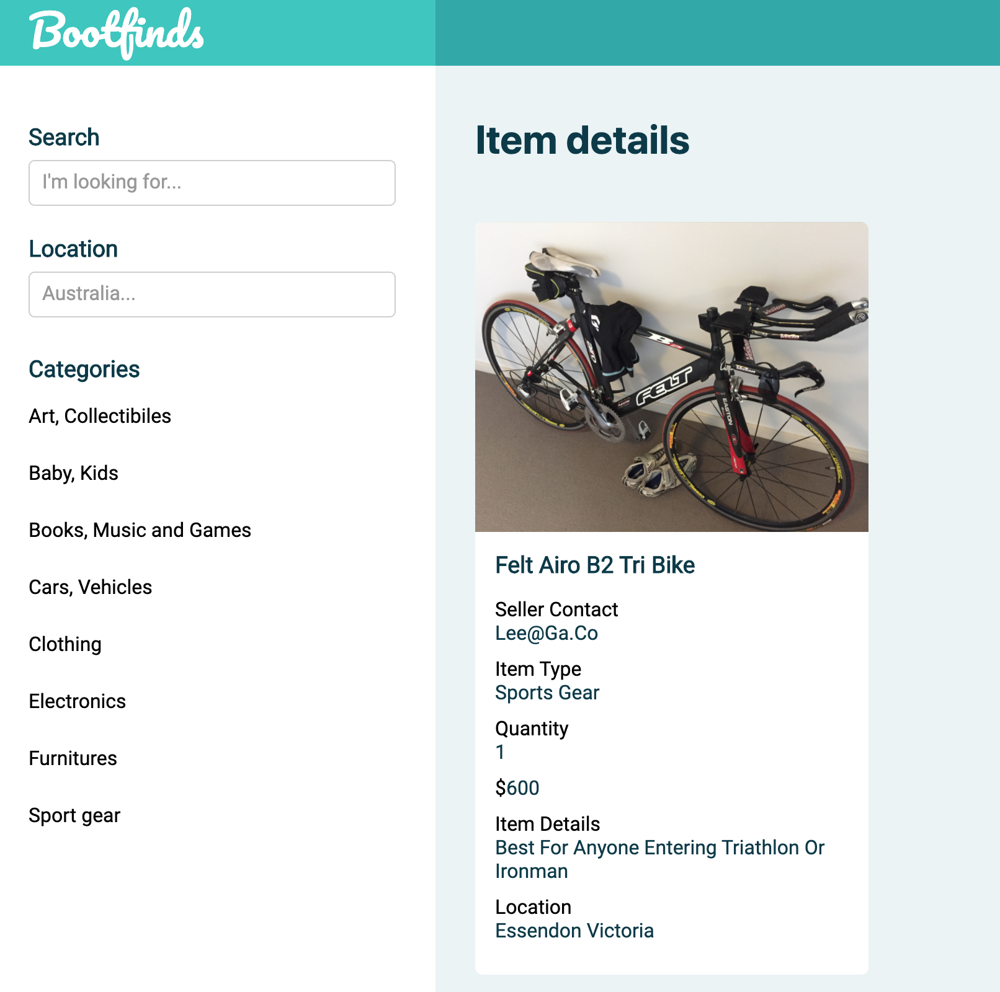
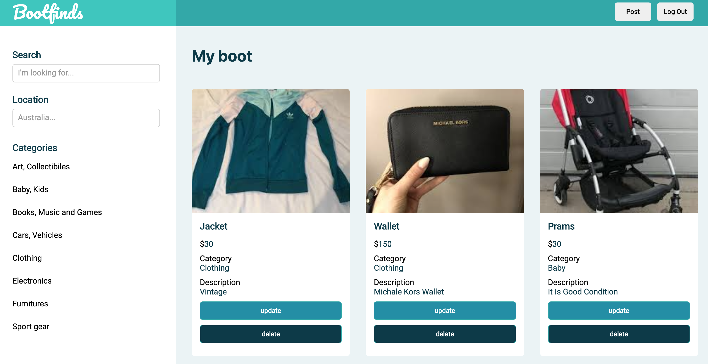

# Project Title

Bootfinds

## About the app

We all have items we don't really need at home. But due to the current circumstances we can't sell them at the flea market. 
Also to have the spot at the fleamarket will cost you some money and you will have to be there for a few hours to sell. 
Let's post the items to the app and sell the items from home.

## Screenshots of the app

    
    
    

## Deployment

* heroku

## Built With

* Node.js
* Express
* ejs
* psql

## version

version 1.0

## future features

* Enabling categories in nav bar 
* Displaying the seller location in the map with item details
